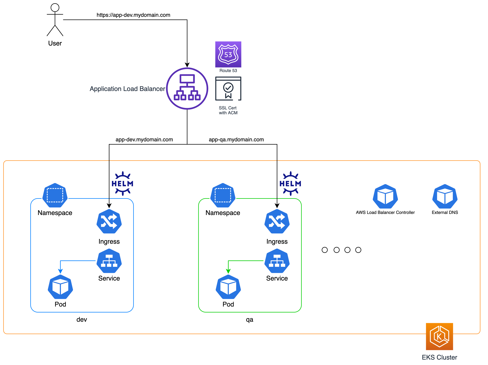

# How to create multiple environments

This solution demonstrate how you can create multiple environments on an app With the help of EKS, Helm, IAM Role for Service Accounts, External-DNS, ACM, and the AWS Load Balancer Controller.

## Prerequisites
- An AWS Account and access to it with enough required permissions _(EKS, VPC, EC2, IAM, Route53, ACM)_
- A public hosted zone on Route53 managing a valid subdomain
- A valid SSL Certificate registered in [ACM](https://aws.amazon.com/certificate-manager/) (can be the public one which is free). This one should wrap the wildcard `*.{your-domain-in-here}` (for example: `*.mariomerco.com`).

## Tools used
- [kubectl](https://kubernetes.io/docs/tasks/tools/)
- [eksctl](https://eksctl.io/)
- [helm](https://helm.sh/)
- [AWS CLI](https://aws.amazon.com/cli/)

## Architecture overview

## Guide

### 1. Create EKS Cluster

> If you already have a Kubernetes cluster with version v1.18 or greater, please make sure the subnets where you want to publish the load balancer are tagged accordingly as the documentation explains https://kubernetes-sigs.github.io/aws-load-balancer-controller/v2.2/deploy/subnet_discovery/. Also, configure the [OIDC provider](https://docs.aws.amazon.com/eks/latest/userguide/enable-iam-roles-for-service-accounts.html)

The simpliest way to create a fully functioning EKS cluster is using **eksctl**. In this repo you can find a `cluster.yaml` file that will create the cluster for you with the Kubernetes version v1.21 and with 3 spot instances as the worker nodes, for cost savings. But you can come with whatever configuration works for you, so please take a look at the [**eksctl site**](https://eksctl.io) to customize your cluster as you want. This config file will create everything it'll need (from the VPC, including the OIDC provider required for giving authentication to the apps, etc).

You can also use the `create-cluster.sh` file to run this very quick. Take a look at it.

After it creates, test your configuration running a simple command like `kubectl get nodes` to make sure you have connectivity to the cluster.

### 2. Install ExternalDNS

[ExternalDNS](https://github.com/kubernetes-sigs/external-dns) is the tool that will be installed in the Kubernetes cluster and will listen to services and ingresses with certain configuration and create DNS records to IPs or Load Balancers (for more details, please refer to the documentation). 

In the `/external-dns` folder you'll find three files:

1. **external-dns.yaml** A preconfigured YAML that you just have to apply to your cluster to install ExternalDNS.
2. **iam.json** A CloudFormation template with the IAM Policy required to be assigned to the Role via [`IAM Role for Service Accounts`](https://docs.aws.amazon.com/eks/latest/userguide/iam-roles-for-service-accounts.html).
3. **run.sh** A bash script that will deploy the CloudFormation stack of the IAM policy, then use `eksctl` to create the [IAM Service Account](https://eksctl.io/usage/iamserviceaccounts/), and finally deploy the external-dns.yaml (The name of the service account is _external-dns_ which is specified in the YAML and in the _eksctl_ command).

> For the lab, please use the `run.sh` file to create and install everything required.

To verify it is running, please check the **ext-dns** pod in the **default** namespace with the command `kubectl get pods | grep external-dns`.

### 3. Install the AWS Load Balancer Controller

[AWS Load Balancer Controller](https://kubernetes-sigs.github.io/aws-load-balancer-controller/v2.2/) is an open source project built by AWS to enable automation provisioning of Load Balancers in AWS based on services and ingresses with certain configuration (for more details, please refer to the documentation). 

In the `/aws-load-balancer-controller` folder you'll find two files:

1. **iam.json** A CloudFormation template with the IAM Policy required to be assigned to the Role via [`IAM Role for Service Accounts`](https://docs.aws.amazon.com/eks/latest/userguide/iam-roles-for-service-accounts.html).
2. **run.sh** A bash script that will deploy the CloudFormation stack of the IAM policy, then use `eksctl` to create the [IAM Service Account](https://eksctl.io/usage/iamserviceaccounts/), and finally uses `kubectl` and `helm` to install the CRDs ([Custom Resource Definitions](https://kubernetes.io/docs/concepts/extend-kubernetes/api-extension/custom-resources/)) and the Helm Chart of the solution, respectively.

> For the lab, please use the `run.sh` file to create and install everything required.

To verify it is running, please check the **ext-dns** pod in the **default** namespace with the command `kubectl get pods --namespace kube-system | grep aws-load-balancer-controller`.